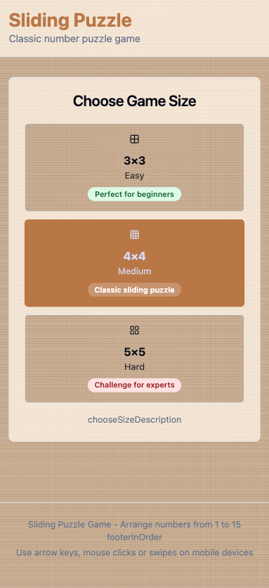

# 15 Puzzle – Web Game

## Description
"15 Puzzle" is a classic 2D sliding puzzle game built for the web, supporting both desktop and mobile devices. The game uses WebGL (PixiJS) for smooth tile animations and includes a timer and move counter. Player scores are saved directly in a database; there is no backend server or REST API.

## Images


## Game URL
in a process...

## Features
- 4×4 game board (15 tiles + 1 empty cell)
- Move tiles via click, tap, arrow keys, or swipe
- Random but solvable tile arrangements
- Smooth animations via WebGL (translate, scale, easing, drop-shadow)
- Timer and move counter
- Modal after victory for entering name (auto-filled via localStorage)
- Score calculation based on time, moves, and board size
- Responsive UI for desktop and mobile

## Tech Stack
- **Frontend:** React 18, TypeScript, Vite, TailwindCSS, PixiJS
- **Database:** MongoDB (client-side access only, no backend logic)
- **UI Components:** Radix UI, Lucide Icons, Recharts, Sonner for notifications

## Game Process
- "New Game" button generates a new board
- Timer starts on first move
- Moves counter updates on each move
- Victory modal for entering name
- Score calculation:  
  `score = max(0, base - penaltyTime - penaltyMoves)`  
  with board size multiplier (3→0.7, 4→1.0, 5→1.6)
- Results saved directly to the database from the client

## Performance
- Target: stable 60 fps on mid-range devices
- Tile animations via PixiJS
- Particle effects on victory using GPU
- Tile text via BitmapText or texture atlas
- Stop ticker on pause or when the tab is hidden

## Security
- Clean player names from HTML/scripts
- Validate minimum time and moves before saving
- Rate limiting handled at the database level on insert

## Testing
- Unit: shuffle, solvable, move validation, scoring
- Integration: database access and score display

## Deployment
- Web version built with Vite
- Static build for hosting on any platform
- TailwindCSS and PixiJS included in the build
- Supports mobile and desktop devices

## Optional Features
- Dark/light theme
- Sounds for moves and victory
- Undo/redo for advanced players
- Social sharing of results

## Getting Started

### Clone the repository
```bash
git clone git@github.com:alejoas1981/15-Puzzle.git
cd 15-Puzzle
```
## Install dependencies
npm install

### Run development server
npm run dev

### Build for production
npm run build

### Preview production build
npm run preview
